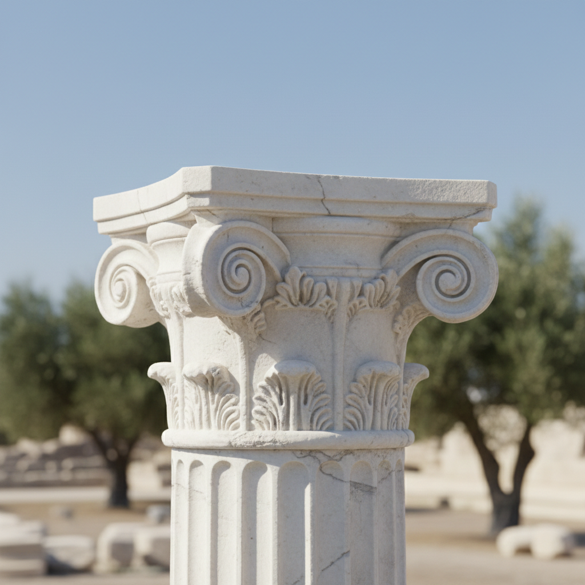
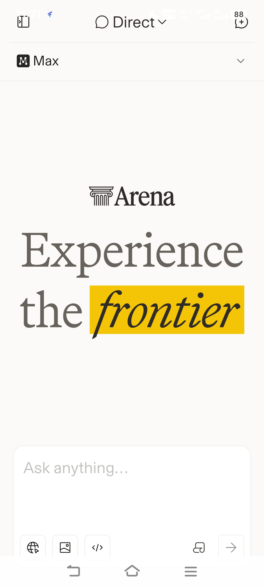
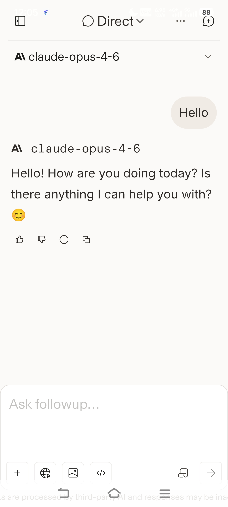

    

    <h1>VeryGoodLMArena </h1>

**使用世界上最强大的 AI，以一种简单、免费、舒适的方式。**  
[English](README.md)

---

VeryGoodLMArena 是一款专为安卓设计的轻量级应用。它通过系统 WebView 优化了 [arena.ai](https://chat.lmsys.org/) 的使用体验。让你在移动端也能像使用原生 App 一样，**简单、免费、舒适**地使用全球顶尖的大语言模型（如 gpt-5.2-high, claude 4.6, gemini 3 等）。

---

## ✨ 项目特点

* **极致轻量**：基于系统 WebView 实现，安装包体积微乎其微，不占用多余系统资源。
* **原生体验**：针对移动端操作逻辑进行了优化，告别浏览器标签页的繁琐。
* **完全免费**：通过 Arena 平台直接免费使用全球最强 AI 模型。
* **简单纯粹**：无广告、无追踪，只为提供最舒适的对话环境。

---

## 📱 实际效果 (Demo)

  
  

---

## 🛠️ 复现与开发

这是一个旨在探索 WebView 封装技术的**练手项目**。

如果你对如何构建类似的应用感兴趣，或者想要自行编译本项目，可以参考仓库中详细的步骤教程：

* [中文复现教程](./tutorial.md)
* [English Tutorial](./tutorial_en.md)

---

## ⚖️ 开源协议

本项目采用 [MIT 协议](./LICENSE) 进行许可。你可以自由地查看、修改和分发代码。

---

## 🚀 快速开始

1. 在 [GitHub Releases](https://github.com/DeepJH/VeryGoodLMArena/releases) 页面下载最新的 APK 文件。
2. 安装并打开 App。
3. 开始与最强大的 AI 免费聊天。

---

> **免责声明**：本项目仅作为技术交流与练习使用，应用内展示的所有内容归原网站服务商所有。